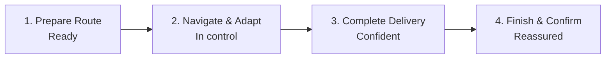

# RouteLogic Velocity: Future-State Journey Map

## Visual Timeline

## 1. Prepare Route

- **User Action:** Open one complete route view → Start without creating manual backups.
- **Internal State:** See offline-ready information → Trust the route before leaving.
- **Pain Point Addressed:** Route loads without connectivity → Eliminate screenshots and printed route copies.

## 2. Navigate & Adapt

- **User Action:** Follow updated directions → Reach stops without unnecessary travel.
- **Internal State:** Receive timely guidance → Rely on RouteLogic throughout the route.
- **Pain Point Addressed:** Changes sync immediately → Avoid texts and calls for updated instructions.

## 3. Complete Delivery

- **User Action:** Mark delivery in one step → Complete frequent tasks faster.
- **Internal State:** Receive clear confirmation → Know status and evidence were recorded.
- **Pain Point Addressed:** Failed uploads retry automatically → Avoid repeated photos and uncertain submissions.

## 4. Finish & Confirm

- **User Action:** Review completed stops → Confirm the route without calling the dispatcher.
- **Internal State:** See accurate progress → Trust the final route record.
- **Pain Point Addressed:** Statuses update immediately → Keep drivers and dispatchers aligned.

## Competitive Advantages Over the Manual Workaround

1. **One reliable workflow → Replace texts, calls, screenshots, and printed route copies.**
2. **Real-time synchronization → Keep drivers and dispatchers working from the same information.**
3. **Fast, resilient core actions → Make RouteLogic easier than manual workarounds.**
